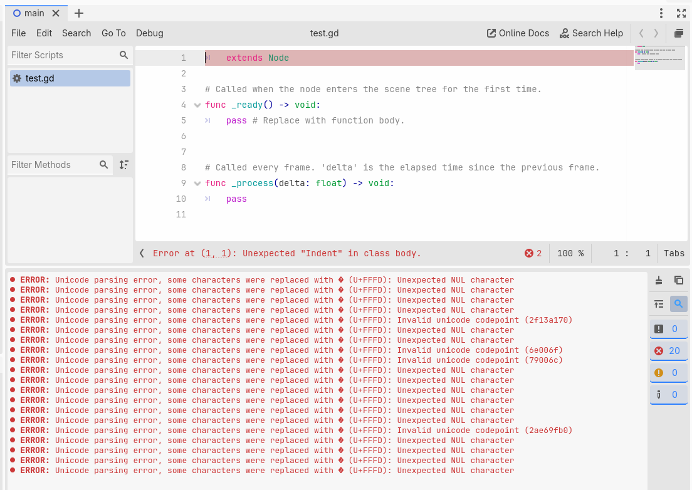
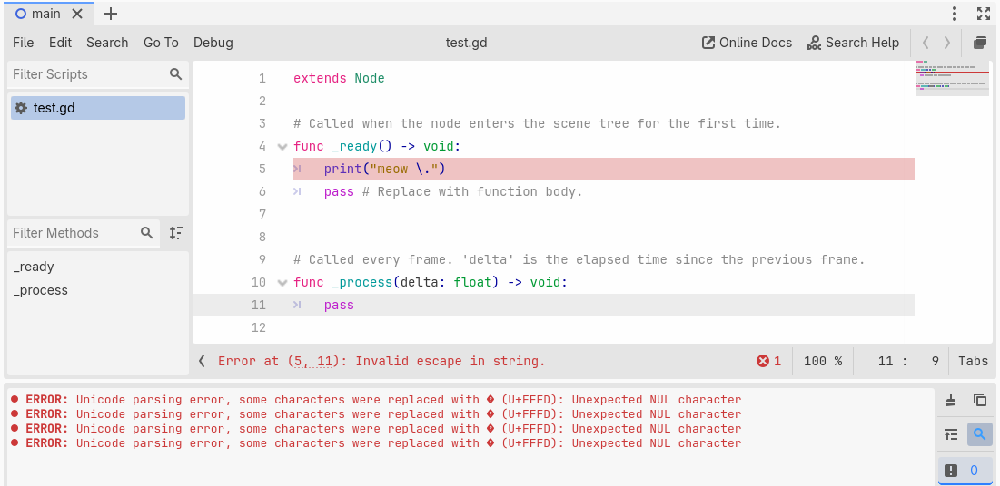

import BlueskyPost from "@/components/BlueskyPost.astro";
import { Code } from "@astrojs/starlight/components";

These are some absurd quirks and facts we've learned about in the process of making GDPatch. While most of these aren't really useful to know, they're quite amusing to keep around for storytelling!

## GDScript is wacky

We observed several bugs in GDScript's tokenizer and parser when porting it into Rust for GDPatch.

### GDScript has no official grammar

GDScript's parser is implemented [in a multi-thousand-line C++ file](https://github.com/godotengine/godot/blob/20b44c9575f3d638d1861813003768155fb0fe9a/modules/gdscript/gdscript_parser.cpp), and there are no official specifications or grammars for the language. The [Godot docs](https://docs.godotengine.org/en/4.6/engine_details/file_formats/gdscript_grammar.html#gdscript-grammar) used to contain a EBNF grammar, but it is "descriptive only" and the engine does not use it. (GDScript is [also not easily described in an EBNF grammar](https://github.com/godotengine/godot-proposals/discussions/14562).)

### Some Godot versions write garbage into the header

When [introducing bytecode script support into Godot 4.3](https://github.com/godotengine/godot/commit/72e5f8c31e9237a4581cf250aa9943a4290f4017), the header array size was improperly set, so 4 bytes of the bytecode header were filled by uninitialized memory. This surfaced as GDScript binary files being non-deterministic and [was fixed in Godot 4.5](https://github.com/godotengine/godot/commit/e120792760795a834e86c05b73804573d956a77b).

```cpp
Vector<uint8_t> contents;
contents.resize(20); // <-- this is 20 bytes...
encode_uint32(identifier_map.size(), &contents.write[0]);
encode_uint32(constant_map.size(), &contents.write[4]);
encode_uint32(token_lines.size(), &contents.write[8]);
// and there's nothing written to offset 12 here!
encode_uint32(token_counter, &contents.write[16]);
```

### Godot reads garbage if a script starts with a tab

If a file begins with a tab, the file pointer will underflow, causing the tokenizer to read before the start of the buffer. This causes the tokenizer to read garbage data and spew several errors.



### Godot freaks out if you escape a carriage return

When escaping a carriage return (`\r`) in a string *without* a line feed (`\n`) following it, Godot reads null characters and spews several errors. In this example, there is a carriage return between the `\` and `.` characters.



### GDScript identifiers are XORed

In the binary GDScript format, all identifiers are inexplicably XORed with the key `0xB6`. This is presumably a (very weak) attempt at obfuscation. [(source)](https://github.com/godotengine/godot/blob/df6235838b63dd49f448547406e339848455c140/modules/gdscript/gdscript_tokenizer_buffer.cpp#L311-L320)

<Code lang="cpp" code={`
// ...
for (int i = 0; i < len; i++) {
    uint8_t tmp[4];
    encode_uint32(s[i], tmp);

    for (int b = 0; b < 4; b++) {
      contents.write[buf_pos + b] = tmp[b] ^ 0xb6;
    }

    buf_pos += 4;
}
// ...
`.trim()} lang="cpp" mark={["0xb6"]} title="gdscript_tokenizer_buffer.cpp" />

## Config files lead to arbitrary code execution

While porting the Variant text parser to Rust, we observed that [object serialization](https://github.com/godotengine/godot/blob/ed1daf0bf001b61586d9930840f2f1394092c079/core/variant/variant_parser.cpp#L995) is *always* enabled, meaning that classes like ConfigFile are unsafe. (This is not a unique discovery from us; there is an [open GitHub issue](https://github.com/godotengine/godot/issues/80562) on this topic.) We discovered this code path could be exploited [within GDRE Tools](https://github.com/GDRETools/gdsdecomp/releases/tag/v2.6.4) with a malicious pack file, as well as within a published Godot game.

<br />
<BlueskyPost uri="at://did:plc:ra3gxl2udc22odfbvcfslcn3/app.bsky.feed.post/3mstj53clss2p" />

## `cargo test` will load GDPatch

Because GDPatch is implemented as a dynamic library that's loaded into the game process, when `cargo test` goes to build and run the crate, it ends up triggering the loader entrypoint. This means GDPatch appears in the build logs, which is quite amusing to stumble upon for the first time.

<br />
<BlueskyPost uri="at://did:plc:ra3gxl2udc22odfbvcfslcn3/app.bsky.feed.post/3mo6fl7y7meow" />

## Godot doesn't reuse file handles

When reading from a pack file, Godot does not reuse a single open file handle for the pack. Instead, it will open a file handle on the pack, read the file, and then close the file handle. This is quite unusual, since it negates all I/O benefits of a virtual filesystem.

Since file paths in Godot can represent files in a pack file, as well as files in the game directory, the engine will also attempt two file opens when trying to read a file: one for the loose file and one for the main pack.

<br />
<BlueskyPost uri="at://did:plc:ra3gxl2udc22odfbvcfslcn3/app.bsky.feed.post/3ls7rjkjefc27" />

<br />
<BlueskyPost uri="at://did:plc:ra3gxl2udc22odfbvcfslcn3/app.bsky.feed.post/3ls7rucqhs227" />
